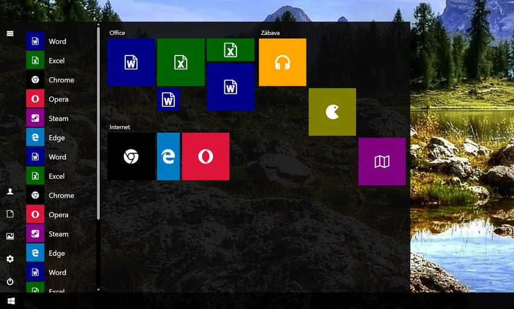

# CSS Grid - Cvičení: Windows 10 Start Panel

## Úvod

Cílem tohoto cvičení je procvičit pokročilé techniky **CSS Grid** na praktickém příkladu simulace Windows 10 Start panelu. Vzhled a HTML struktura je již připravena – tvým úkolem je nakódovat CSS Grid layouty.

## Struktura Gridů

Projekt obsahuje **vícenásobně vnořené Gridy** s různými technikami:

```
┌─────────────────────────────────────────────────────────────┐
│ .start-panel (3 sloupce)                                    │
│                                                             │
│  ┌───────┐ ┌──────────────────┐ ┌─────────────────────────┐ │
│  │ IKONY │ │ SEZNAM APPLIKACÍ │ │   GRID OBLASTÍ          │ │
│  │       │ │  (seznam <ul>)   │ │  (grid-template-areas)  │ │
│  │ (grid)│ │                  │ │  ┌────────┬───────────┐ │ │
│  │       │ │                  │ │  │ OFFICE │           │ │ │
│  │       │ │                  │ │  │ (grid) │   ZÁBAVA  │ │ │
│  │       │ │                  │ │  ├────────┤   (grid)  │ │ │
│  │       │ │                  │ │  │INTERNET│           │ │ │
│  │       │ │                  │ │  │ (grid) │           │ │ │
│  │       │ │                  │ │  └────────┴───────────┘ │ │
│  └───────┘ └──────────────────┘ └─────────────────────────┘ │
└─────────────────────────────────────────────────────────────┘

  Každá sekce (OFFICE, INTERNET, ZÁBAVA) obsahuje vlastní vnořený grid
```

## Co musíš udělat?

Základní rozměr je 50px (velikost nejmenší ikony). Základní gap jsou násobky 5px.

### 1. **.start-panel** – Hlavní Layout
Zvol vhodný `grid-template-columns` a nastav gap.

### 2. **.start-panel__icons** – Vertikální Menu
Vytvořit single-column grid s ikonami a mezerou na horní část.
**Nápověda:** Použij kombinaci `1fr` a `repeat()` v `grid-template-rows`.

### 3. **.start-panel__grid** – Oblasti (Grid Template Areas)
Rozděl prostor do 2 řádků a 2 sloupců s pojmenovanými oblastmi:
**Nápověda:** Nastav `grid-template-areas` a `align-content`.

### 4. **.apps__grid** – Pozicování Aplikací
Vytvoř 6-sloupcový grid (50px), kde se aplikace umisťují:
- Jednotlivá políčka: 50px × 50px
- Větší aplikace zabírají více políček (2×2, 2×1 atd.)
**Nápověda:** Všechny řádky mají stejnou výšku – jaké properties to řeší?

### 5. **Modifikační Třídy** – Umisťování Prvků
Různé aplikace mají různé pozice a velikosti:

```
Velikosti:
- .app--g2x2   → 2 sloupce, 2 řádky
- .app--g2x1   → 2 sloupce, 1 řádek  
- .app--g1x2   → 1 sloupec, 2 řádky

Pozice (Office grid):
- .app--off-3  → Sloupec 3
- .app--off-4  → Řádek 2, Sloupec 5
- .app--off-5  → Řádek 1, Sloupec 5

Pozice (Internet grid):
- .app--in-3   → Řádek 1, Sloupec 3

Pozice (Zábava grid):
- .app--fun-2  → Řádek 3, Sloupec 3
- .app--fun-3  → Řádek 5, Sloupec 5
```

Vyplň pravidla pro všechny třídy pomocí `grid-column-start`, `grid-row-start` a `grid-*-end: span`.

## Výstup

V souboru `styles/main.css` máš připraveny všechny selektory. Ostatní soubory měnit nemusíš.

## Referenční Řešení



## Klíčové Koncepty k Aplikaci

- `display: grid` – Aktivace grid layoutu
- `grid-template-columns` – Definice sloupců
- `grid-template-rows` – Definice řádků
- `grid-template-areas` – Pojmenované oblasti
- `grid-gap` – Mezera mezi prvky
- `grid-column-start`, `grid-row-start` – Umístění prvku
- `grid-column-end: span X`, `grid-row-end: span Y` – Rozměry prvku
- `minmax()` – Flexibilní sloupce
- `repeat()` – Opakování vzoru
- `auto-rows` – Výchozí výška řádků

## Tipy

1. **Debugování:** Použij dev tools → `Inspect` → záložka **Layout** pro vizualizaci gridu
2. **Grid Lines:** Čísluješ je od 1, ne od 0! Sloupec 1 má index 1, nikoliv 0.
3. **Span:** `span 2` znamená "zabírá 2 buňky" (nejedná se o absolutní pozici)
4. **Vnoření:** Každá `.apps__grid` je **nezávislý grid** – počty sloupců se nevztahují k rodičovskému gridu!
